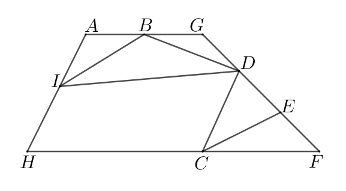
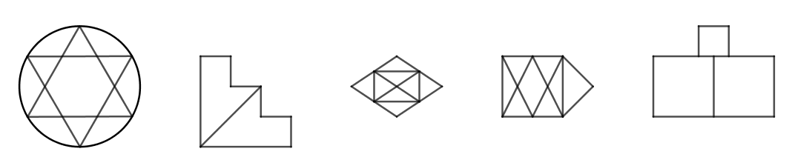
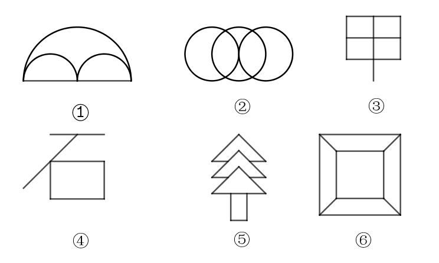
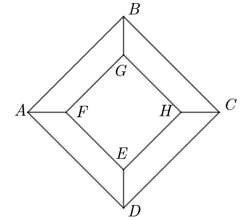
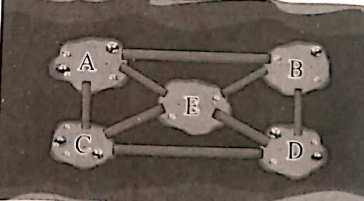
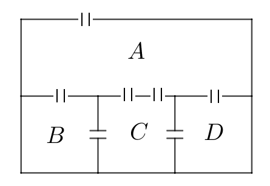
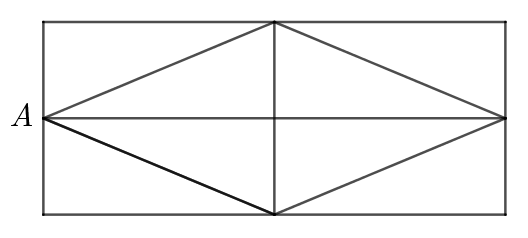
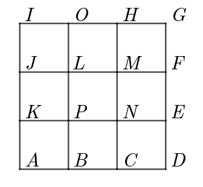
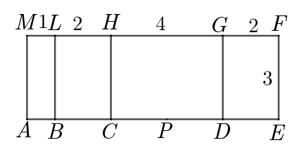

# 第1讲 多笔画

一、一笔画  
1. 定义：笔不离纸，线不重复，一笔画完   
2. 判断方法 $\begin{cases}  连通图\\ 奇点个数 \textcolor{red}{\begin{cases} 0个：同进同出\\ 2个：一进一出 \end{cases}} \end{cases}$

二、多笔画  
1. 最少笔画数=奇点个数 $\div$ 2
2. 多笔变一笔
   1. 目标：奇点数变为0或2
   2. 方法：两个奇点间添线或去线

三、生活应用  
1. 实物图  
转化为点线图（区域变点，通道变线）
2. 最短路线（走遍所有可以重复）：若不能一笔画，奇点间添加重复线段，重复的线段要少且要短。
   
## 巩固题

1. 请你填一填

    

    图（1）至少_____笔画成；   
    图（2）至少_____笔画成；   
    图（3）至少_____笔画成；   
    图（4）至少_____笔画成；   
    图（5）至少_____笔画成；   
    图（6）至少_____笔画成.    
    （填写阿拉伯数字）

2. 下图是一个公园的道路平面图，要使游客走遍每条路且不重复，入口、出口分别应该设置在哪里？(    )

    

    $\;A.\;B入C出 \qquad B.\;I入E出 \qquad C.\; E入D出 \qquad D.\; I入D出$

## 基础过关

3. 下列图形中能不重复地一笔画出的有_____个。

    

4. 请看图填写下表：

    

    |图|①|②|③|④|⑤|⑥|
    |---|---|---|---|---|---|---|
    |奇点数|  |  |  |  |  |  |
    |最少笔画数|  |  |  |  |  |  |

5. 下图能否一笔画，如果不能，请添加最少的线段将图改成一笔画的图形。

    

6. 湖中有 $A、B、C、D、E$ 五个小岛，有八座桥将五个小岛连接起来，现在艾迪想要从其中一个小岛出发，一次不重复地走完所有的桥，能不能实现？如果可以请你说说艾迪该从哪个岛出发？如果不可以，请你加上一座桥，帮艾迪实现想法。

    

## 能力提升

7. 图中是怪兽旅馆的平面图，它由四间房间组成，任意两展室之间都有门相通，请问能否一次不重复地穿过所有的门？利用多笔画理论知识说明。

    

8. 如图所示，某小区花园的道路为一个长480米，宽200米的长方形，一个边长为260米的菱形和十字交叉的两条道路组成，一天，王大爷从A处进入花园，走遍花园的所有道路并从A处离开，那么，他从进入花园到走出花园最少要走_______米。

    

9. 一辆清洁车清扫街道，每段街道长1千米，清洁车由A出发，走遍所有的街道再回到A，怎样走路程最短，全程多少千米？请给出一种清扫的路劲。

    

## 创新挑战

10. 下图是某小区的街道分布图，街道长度如图所示（单位：公里），图中各字母表示不同楼的代号，一名快递员从快递集中点（快递集中点位于C楼和D楼之间的P处）出发要走完所有街道后仍回到快递集中点，问怎样走路线最短？最短路线是多少公里？

    
