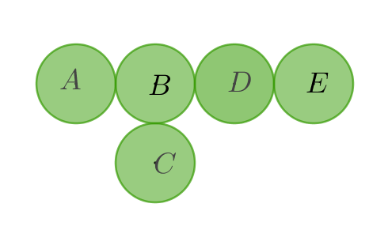
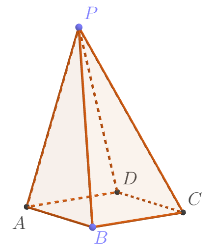

# 第2讲 加法原理

【巩固一】   
如果没有规定是几位数，必须要分类。   
一位数：  
两位数：  
三位数：  

## 巩固题

1. 威尔拿出三张数字卡片，分别写着数字1、3、8，那么可以组成______个不同的无重复数字的自然数。
$\\[5em]$

2. 将8块糖分三天吃完，每天都吃，而且数量各不相同，一共有_____种不同的吃法。
$\\[5em]$
   
## 基础过关题

1. 用0、1、9这三张数字卡片可以组成_____个不同的三位数。
$\\[5em]$

2. 自然数21，654，7521这些数有一个共同的特点，至少有两个数字，而且相邻两个数字，左边的数字大于右边的数字，我们取名为“下降数”，用4、6、7、9这四个数，可以组成_____个“下降数”。
$\\[5em]$

3. 博士将10根相同的棒棒糖分成3堆，共有多少种不同的分法？
$\\[5em]$

4. 将10写成3个自然数之和，共有多少种不同的写法？
$\\[5em]$
   
## 能力提升

1. 新华小学每周安排4次课外活动，内容有体育、文艺、科技三种，如果要求一周内各种活动至少有一次，并且同一种活动不能连着安排，那么，共有多少种不同的安排方法？（难度系数五星*****）
$\\[5em]$

2. 如图所示，一只青蛙在五片荷叶之间跳动，每次都从一片荷叶跳到相邻的另一片荷叶上。如果青蛙开始在D荷叶上，然后连续跳了3次，那么一共有______种不同的跳法。

$\\[5em]$

3. 又到了炎热的夏天，又是吃西瓜的季节，艾迪准备将12个相同的西瓜分成3堆，共有______种不同的分法。
$\\[5em]$

## 创新挑战

如图，已知蚂蚁要从一个四棱锥的顶点P出发，沿着这个四棱锥的棱依次不重复地走遍5个顶点即停止，请问：这只蚂蚁一共有多少种不同的走法？

## 参考答案

### 巩固题

1. 威尔拿出三张数字卡片，分别写着数字1、3、8，那么可以组成______个不同的无重复数字的自然数。

    解：没有规定几位数，必须进行分类讨论。  
    一位自然数有：1、3、8  
    两位自然数有：13、18、31、38、81、83  
    三位自然数有：138、183、318、381、813、831  
    共有 3+6+6=15个不同的无重复数字的自然数。

2. 将8块糖分三天吃完，每天都吃，而且数量各不相同，一共有_____种不同的吃法。

    解：因为要求数量不同，且是分三天吃完，故与顺序有关。   
    8=1+2+5=1+5+2=2+1+5=2+5+1=5+1+2=5+2+1  
     =1+3+4=1+4+3=3+1+4=3+4+1=4+1+3=4+3+1  
    综上，共有6+6=12种。 
   
### 基础过关题

1. 用0、1、9这三张数字卡片可以组成_____个不同的三位数。

    解：用枚举法来组成。这里要特别注意，卡片9还可以是数字6，颠倒过来就是6，即一张卡片可以代表两个不同的数字。  
    三位数有：109、190、106、160、601、610、901、910   
    故共有8个不同的三位数。

2. 自然数21，654，7521这些数有一个共同的特点，至少有两个数字，而且相邻两个数字，左边的数字大于右边的数字，我们取名为“下降数”，用4、6、7、9这四个数，可以组成_____个“下降数”。

    解：必须分类讨论，下降数至少是两位数。  
    两位下降数有：97、96、94、76、74、64  
    三位下降数有：976、974、964、764  
    四位下降数有：9764  
    共有6+4+1=11个下降数

3. 博士将10根相同的棒棒糖分成3堆，共有多少种不同的分法？

    解：拆分数10为下列情形：
    10=1+1+8=1+2+7=1+3+6=1+4+5 （相邻即停）  
      =2+2+6=2+3+5=2+4+4 （相同即停）  
      =3+3+4 （相邻即停）  
    综上，共有4+3+1=8种不同的分法。      

4. 将10写成3个自然数之和，共有多少种不同的写法？

    解：这里要注意0也是自然数，不能忽视它。  
    10=0+0+10=0+1+9=0+2+8=0+3+7=0+4+6=0+5+5 （相等即停）  
      =1+1+8=1+2+7=1+3+6=1+4+5 （相邻即停）  
      =2+2+6=2+3+5=2+4+4 （相等即停）   
      =3+3+4 （相邻即停）  
    综上，共有6+4+3+1=14种不同的分法。  

### 能力提升

1. 新华小学每周安排4次课外活动，内容有体育、文艺、科技三种，如果要求一周内各种活动（指体育、文艺、科技）至少有一次，并且同一种活动不能连着安排，那么，共有多少种不同的安排方法？（难度系数为五星）

    解：枚举法，与顺序有关。  
    如图，第一天是体育，第二天可能是文艺或科技，...

    |第一天|第二天|第三天|第四天|说明|
    |-----|-----|-----|------|-----|
    |体育 |文艺 |科技  |体育  ||
    |...  | 文艺|科技  |文艺  ||
    |...  | 文艺|体育  |文艺  |舍去，科技没有安排|
    |...  | 文艺|体育  |科技  ||
    |...  |科技 |体育  |文艺  ||
    |...  |科技 |体育  |科技  |舍去，文艺没有安排|
    |...  |科技 |文艺  |体育  |
    |...  |科技 |文艺  |科技  |

    共有效地安排只有8-2=6种。  
    同理，如果第一天是文艺，也有6种，第一天是科技，也是6种。  
    综上，共有 $\large 6 \times3=18$ 种。  

2. 如图所示，一只青蛙在五片荷叶之间跳动，每次都从一片荷叶跳到相邻的另一片荷叶上。如果青蛙开始在D荷叶上，然后连续跳了3次，那么一共有______种不同的跳法。

    解：用画图方式，画出各种跳法可能性。
    每跳一次，树形图增加一段，所以，一共有三段，如下图：

|第一次|第二次|第三次|第四次|
|-----|-----|-----|------|
|D    |B |A  |B  |
|...  | B|C  |B  |
|...  |B |D  |B  |
|...  |B |D  |E  |
|...  |E |D  |B  |
|...  |E |D  |E  |

    如上表，共有6种不同的跳法。

3. 又到了炎热的夏天，又是吃西瓜的季节，艾迪准备将12个相同的西瓜分成3堆，共有______种不同的分法。

    解：实际上就是将12拆成3个非零自然数之和。   
    12=1+1+10=1+2+9=1+3+8=1+4+7=1+5+6 （相邻即停）  
      =2+2+8=2+3+7=2+4+6=2+5+5 （相等即停）  
      =3+3+6=3+4+5 （相邻即停）   
      =4+4+4 （相等即停）   
    综上，共有5+4+2+1=12种不同的分法。  

### 创新挑战

如图，已知蚂蚁要从一个四棱锥的顶点P出发，沿着这个四棱锥的棱依次不重复地走遍5个顶点即停止，请问：这只蚂蚁一共有多少种不同的走法？

解：画树形图如下图：

$P \begin{cases}
\to A \begin{cases} B \to C \to D\\ D \to C \to B\\ \end{cases}\\
\to B \begin{cases} A \to D \to C\\ C \to D \to A\\ \end{cases}\\
\to C \begin{cases} B \to A \to D\\ D \to A \to B\\ \end{cases}\\
\to D \begin{cases} A \to B \to C\\ C \to B \to A\\ \end{cases}\\
\end{cases}$

如上图所示，这只蚂蚁一共有8种不同的走法。
答：这只蚂蚁一共有8种不同的走法，分别是 $P\to A\to B\to C\to D,P\to A\to D\to C\to B,P\to B\to A\to D\to C,P\to B\to C\to D\to A,P\to C\to B\to A\to D,P\to C\to D\to A\to B,P\to D\to A\to B\to C,P\to D\to C\to B\to A$