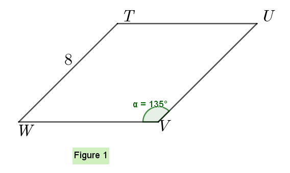

# 三角比练习题-1

$(A)\; \qquad (B)\; \qquad (C)\; \qquad (D)\; \qquad (E)\;$

1. The area of the rhombus TUVM in Figure 1 is  
    $(A)\; 64 \qquad (B)\; 32 \qquad (C)\; 5.7 \qquad (D)\; 45.3 \qquad (E) 64\sqrt2$

    

2. Which of the following is equal to $(\sec\theta)(\cot\theta)$?    
    $(A)\; \sin\theta \qquad (B)\;\cos\theta \qquad (C)\;\sec\theta \qquad (D)\;\csc\theta \qquad (E)\;\cot\theta$
3. The statement, "If a triangle is equilateral(等边的), then it is not scalene(斜三角形，不等边三角形)," is logically equilvalent(等价) to which of the following?    
    I. If a triangle is not scalene,then it is equileteral.    
    II. If a triangle is not equilateral, then it is scalene.    
    III. If a triangle is scalene, then it is not equilateral.   
    (A) I only    (B) II only    (C) III only   (D) I and II only   (E) I and II only
4. $(2\sin x)(9\sin x)-(6\cos x)(-3\cos x)=$   
    $(A)\;18 \qquad (B)\;18\sin^2x-18\cos^2x \qquad (C)\;18\sin x+18\cos x \qquad (D)\;36 \qquad (E)\;1$
5. If the sides of a right triangle have lengths x-3, x+1, and x+5, then x=   
    $(A)\;-1 \qquad (B)\;15 \qquad (C)\;4 \qquad (D)\;5 \qquad (E)\;12$

6.  
