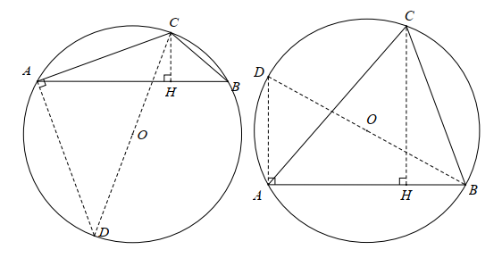

# 八升九数学 第二讲

## Lesson 2 正余弦定理

1. 任意角的三角比($0\degree \cdots 180\degree$)

    单位圆解释正弦、余弦、正切和余切函数的曲线   
    分析不同三角比的变化趋势

2. 两角和差公式及其几何证明

    - $\sin(\alpha\pm\beta)=\sin\alpha\cos\beta \pm \cos\alpha\sin\beta$  
    - $\cos(\alpha\pm\beta)=\cos\alpha\cos\beta \mp \sin\alpha\sin\beta$  
    - $\tan(\alpha\pm\beta)=\dfrac{\tan\alpha \pm \tan\beta}{1\mp\tan\alpha\tan\beta}$  
    
    令 $\alpha=\beta$, 则有同角的二倍角关系如下：   
    - $\sin 2\alpha=2\sin\alpha\cos\alpha$  
    - $\cos 2\alpha=\cos^2\alpha-\sin^2\alpha=2\cos^2\alpha-1 = 1-2\sin^2\alpha$  
    - $\tan 2\alpha=\dfrac{2\tan\alpha}{1-\tan^2\alpha}$

    令 $t=\tan\alpha \in R$, 则有万能公式：  
    - $\sin 2\alpha=\dfrac{2t}{1+t^2}$;
    - $\cos 2\alpha=\dfrac{1-t^2}{1+t^2}$;
    - $\tan 2\alpha =\dfrac{2t}{1-t^2}$

    几何证明如下：

    

    **令两角和公式中的 $\beta$ 为 $-\beta$, 就可以得到两角差公式**

3. 正弦定理及其几何证明

    $\triangle ABC, R$ 为三角形外接圆的半径，则有：  
    $\dfrac{a}{\sin A}=\dfrac{b}{\sin B}=\dfrac{c}{\sin C}=2R$   

    
    
    **证明一** 在锐角或钝角三角形$ABC$中，  
    $过点C作AB边上的高CE，交AB于点E\\
    连接CE，有\\
    CE=b\sin A=a\sin B\\
    \therefore \dfrac{a}{\sin A}=\dfrac{b}{\sin B}\\
    同理，可以得到\\
    a\sin C=c\sin A \\
    \therefore \dfrac{a}{\sin A}=\dfrac{c}{\sin C}\\$

    **证明二** 面积法  
    同上作辅助线，利用三角形面积公式有：  
    $S_{\triangle ABC}=\frac{1}{2}bc\sin A=\frac{1}{2}ac\sin B=\frac{1}{2}ab\sin C$

    上述等式同时除以 $abc$ ,然后颠倒一下就是正弦定理。

    **证明三** 外接圆方法,在锐角或钝角三角形$ABC$中  
    作$\triangle ABC$的外接圆，过点$C$作直径$CD$，  
    $交外接圆于点D，连接CD和BD。\\
    \because同弧所对的圆周角相等，\\
    \therefore \angle A=\angle D \\
    在 Rt\triangle DBC 中，\sin D=\frac{BC}{DC}=\frac{a}{2R}\\
    \therefore \sin A=\frac{a}{2R}, \implies \frac{a}{\sin A}=2R\\
    同理可得 \frac{b}{\sin B}=\frac{c}{\sin C}=2R$

4. 正弦定理变形

    主要利用比例性质来进行变形。

    - $a:b:c=\sin A:\sin B:\sin C$
    - $a=2R\sin A, b=2R\sin B, c=2R \sin C$
    - $a\sin B=b\sin A, b\sin C=c\sin B, a\sin C=c\sin A$
    - $\frac{a+b+c}{\sin A+\sin B+\sin C}=\frac{a}{\sin A}=\frac{b}{\sin B}=\frac{c}{\sin C}=2R$
    - $S_{\triangle ABC}=\frac{1}{2}ab\sin C=\frac{1}{2}bc\sin A=\frac{1}{2}ac\sin B$
  
5. 三类正弦定理解三角形的问题

    - 已知三角形的两角与一边，求其他两边和一角
    - 已知三角形的两边和其中一边所对应的角，求其他边角
    - 运用 $a:b:c=\sin A:\sin B:\sin C$ 解决角之间的转换关系
  
6. 余弦定理及其几何证明

4. 