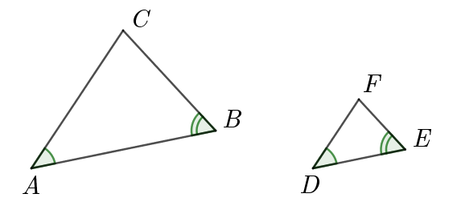
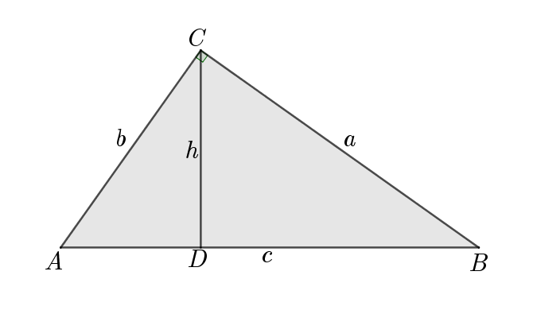
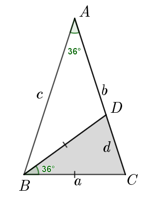

# 八升九数学 第三讲

## Lesson 3 相似形 Similar Geometry

### 概念

1. 两个形状相同的图形称为**相似图形**，最基本的相似图形是**相似三角形 Similar Triangles**．
2. 对应边之比称为**相似比**，相似比为1的两个相似三角形是**全等三角形**．
3. 如果两个多边形不仅相似，而且对应顶点的连线相交于一点，那么这样的两个图形叫做**位似图形**，这个点叫做**位似中心**，这时的相似比又称为**位似比**．

### 相似三角形 Similar Triangles

4. 对应角相等或者对应边成比例(proportional)的两个或多个三角形，叫作**相似三角形**．

Similar Triangles have the same shape.  
Each corresponding pair of angles has the same measure: 

$m\angle A=m\angle D, m\angle B=m\angle E, m\angle C=m\angle F$

The ratios of corresponding sides are proportional.

$\dfrac{AB}{DE}=\dfrac{BC}{EF}=\dfrac{CA}{FD}$

    因此，三角形全等是相似的特殊情况，而三角形相似是三角形全等的发展，两者在判定方法及性质方面有许多类似之处．

    因此，在研究三角形相似问题时，我们应该注意借鉴全等三角形的有关定理及方法．

    当然，我们又必须同时注意它们之间的区别，要特别注意的是比例线段在研究相似图形中的作用．

    本讲着重探讨相似三角形与比例线段的有关计算与证明问题．

### 知识点

1. 三角形相似的判定定理
    - 判定定理1 两角对应相等，两三角形相似；（AA，或AAA）
    - 判定定理2 两边对应成比例且夹角相等，两三角形相似；（SAS）
    - 判定定理3 三边对应成比例，两三角形相似；（SSS）
    - 判定定理4 斜边与一条直角边对应成比例的两个直角三角形相似；（HL）
    - 判定定理5 直角三角形斜边上的高分成的两个直角三角形与原直角三角形相似，即三个直角三角形相似；
    - 由相似性质容易得到射影定理
    
    $（Rt∆ABC∽Rt∆ACD∽Rt∆CBD）\\
    （1）h^2=AD•DB  \qquad    CD^2=AD•DB\\
    （2）a^2=DB•AB  \qquad    BC^2=BD•AB\\
    （3）b^2=AD•AB  \qquad    AC^2=AD•AB\\$

    - 黄金三角形中：顶角为∠BAC=36°的等腰三角形ABC（称为黄金$△$）中，BD是∠CBA的角平分线，
    则 $△ABC∼△BCD$   
    所以 $BD：AC=CD：BC，BC^2=BD^2=CD•AC$
    

2. 三角形相似的判定定理**推论**
    - 顶角或底角相等的两个等腰三角形(Isosceles Triangle)相似； 
    - 腰和底对应成比例的两个等腰三角形相似； 
    - 有一个锐角相等的两个直角三角形(Right Triangle)相似； 
    - 如果一个三角形的两边和其中一边上的中线与另一个三角形的对应部分成比例，那么这两个三角形相似。

3. 三角形相似特例
    - 两个全等三角形一定相似；
    - 两个等腰直角三角形一定相似；
    - 两个等边三角形(Equilateral Triangle)一定相似；
    - 两个直角三角形和两个等腰三角形不一定相似；

4. 相似三角形的性质
    - 相似三角形对应角相等、对应边成比例；
    - 相似三角形的周长之比，对应边的高、角平分线、中线之比，都等于相似比（对应边之比）；
    - 相似三角形的面积之比等于相似比的平方．

5. 多边形相似特例
   - 两个正方形相似
   - 两个正n边线相似
   - 

### 例题讲解

#### 例1

如图，已知：$\triangle ABC, DE//BC， EF//CD，$求证：$AD是AF和AB的比例中项$

例1． 证明：$∵ED∥CB
∴  ED：CB= AE：AC=AD：BA$  
同理 $∵FE∥DC
∴  FE：DC=AE：AC=AF：AD \\
∴  AD：BA=AF：AD，AD^2=AF \times AB$   证毕

#### 例2． 

梯形$ABCD$中，$DC∥AB，DC＝2 cm，AB＝3.5 cm，\\且MN∥PQ∥AB，DM＝MP＝PA，求：MN，PQ$
  
例2  解：连接一条对角线，如DB，分别交MN、PQ于点E、F，  
由平行线分线段成比例，可得：  
$DM：DA=ME：AB，DA=DM+MP+PA=3DM，\\  
∴DM：(3DM)=ME：3.5，ME=7/6 cm\\  
EN：CD=BN：CB=2/3，	EN=4/3 cm\\  
∴MN=ME+EN=7/6+4/3=15/6=5/2=2.5 cm$  
同理：  
$PF：AB=DP：DA=2/3，∴PF=2/3AB=7/3\\  
FQ：CD=BQ：CB=1/3，∴FQ=1/3CD=2/3\\  
∴PQ=PF+FQ=7/3+2/3=9/3=3$  

#### 例3． 

四边形ADEF为菱形，且AB＝14厘米，BC＝12厘米，AC＝10厘米．  求：BE  

例3 解：由题设知道：$AD=ED=FE=AF$, 设该菱形的边长为 $a$.  

$（1）ED∥CA，\\  
∴ED：CA=BE：CB， ED：10=BE：12，BE=6a/5\\  
（2）FE∥AB，\\  
∴FE：AB=CE：CB，FE：14=(12-BE)：12，12-BE=6a/7\\  
∴14：10=BE：(12-BE)，\\
合比定理得到\\  
14：24=BE：12，故BE=7 cm$  

#### 例4． 

梯形的上底长1.2厘米，下底长1.8厘米，高1厘米，求：延长两腰后与下底所成的三角形的高为($\qquad$) 厘米。

例4 解：因为$A'D∥B'C ，IH=1，∴ ∆FA’D∽∆FB’C’$,   
根据相似∆的对应边上的高之比等于相似比，  
$∴A'D：B'C=FI：FH=FI：(FI+1)$  
即 $1．2：1．8=FI：(FI+1)，$    
由分比定理得到：  
$1．2：(1．8-1．2)=FI：1，\\  
∴FI=2 cm\\  
∴△FB'C'的高为FI+IH=3cm$  

#### 例5． 

已知：梯形ABCD中，AB∥DC，E是AB的中点，直线ED分别与对角线AC和BC的延长线交于M、N点．  求证：MD：ME＝ND：NE

例5  证明：  
$因为 AE∥CD，∴∆AME∽∆CMD (AAA)\\
∴ME：MD=AE：CD\\
同理 EB∥CD，∴∆NBE∽∆NCD (AAA)\\
∴EB：CD=NE：ND\\
又因为E为AB的中点，∴AE=EB\\
故 ME：MD=NE：ND，即MD：ME=ND：NE（证毕）$

#### 例6． 

已知：△ABC中，D在AC上，且AD：DC＝1：2，E为BD的中点，AE的延长线交BC于F，求证：BF：FC＝1：3
   
例6  证明1：取DC的中点M，过D、M两点分别作AF的平行线，分别交于BC于G、N两点．  
则：由D、M是AC的三等分点，得：FG=GN=NC  
由E是BD的中点，得：BF=FG  
所以：BF=FG=GN=NC  
所以：BF：FC=1：3  

例6 证明2：由**燕尾定理**，将边之比化为面积之比．  
$因为：AD：DC=1：2\\
由燕尾定理得到：\\
S_{△ABE}：S_{△BEC}=AD：DC=1：2\\
BF：FC=S_{△ABE}：S_{△AEC}\\
由等积变换得到：\\
S_{△ADE}：S_{△CDE}=AD：DC=1：2\\
E为BD的中点，∴S_{△ABE}=S_{△ADE}\\
设a=S_{△ABE}，则S_{△ADE}=a，S_{△CDE}=2a，S_{△AEC}=3a，\\
∴BF：FC=a：(3a)=1：3$

#### 例7． 

已知：在Rt∆ABC 中，∠BAC=90° ，AD 是BC边上的高，E是BC边上的一个动点（不与B，C 重合），EF⊥AB ，EG⊥AC ，垂足分别为F，G ．  
（1）求证：EG：AD=CG：CD；  
（2）FD 与 DG是否垂直？若垂直，请给出证明；若不垂直，请说明理由；  
（3）当AB=AC时，∆FDG 为等腰直角三角形吗？并说明理由．
  
$例7 （1）证明：在△CGE和△CDA中\\
∵ ∠C=∠C，EG⊥CA，AD⊥BC\\
∴Rt△CGE∼Rt△CDA  (AAA)\\
故 CG：CD=EG：AD\\
（2）结论是FD⊥DG．\\
由（1）知道 AF：AD=CG：CD\\
又 ∠FAD=∠GCD\\
∴△FAD∼△GCD （SAS）\\
∴∠ADF=∠CDG\\
∴∠FDG=∠ADF+∠ADG\\
 =∠CDG+∠ADG=90°\\
∴FD⊥DG\\
（3）当BA=CA时，AD=CD，\\
又∠FAD=∠GCD\\
由（1）知道 CG=EG，∴CG=AF，\\
∴△FAD≌△GCD  （SAS）\\
∴FD=DG\\
且由（2）知道∠FDG=90°\\
故 △FDG是等腰直角三角形$

#### 例8． 

如图，在平行四边形ABCD中，AC与BD交于O点，E为AD延长线上一点，
OE交CD于F，EO延长线交AB于G．求证：$\dfrac{AB}{DF}-\dfrac{AD}{DE} = 2$．
   
分析 求证中诸线段的位置过于“分散”，因此，应利用平行四边形的性质，通过添加辅助线使各线段“集中”到一个三角形中来求证．

$例12 证明：∵ABCD是平行四边形\\
∴∠DOF=∠BOG，OD=OB，∠FDO=∠GBO\\
故 △DOF≅△BOG， （ASA）\\
∴ BG=DF，OG=OF\\
∵DF∥AG，∴AG：DF=AE：DE\\
故 \dfrac{AB}{DF}-\dfrac{AD}{DE}=\dfrac{AG+GB}{DF}-\dfrac{AD}{DE}=\dfrac{AE}{DE}+\dfrac{GB}{DF}-\dfrac{AD}{DE}=\dfrac{AE-AD}{DE} +1=1+1=2证毕$

#### 例9． 

如图，已知$AB∥EF∥CD$，若AB=6厘米，CD=9厘米．求EF．
 
分析 由于BC是$△ABC与△DBC$的公共边，且$AB∥EF∥CD$，利用平行线分三角形成相似三角形的定理，可求EF．

$例9  解：∵EF∥AB ∴△EFC∼△ABC\\
故 EF：AB=FC：BC        （1）\\
同理 EF∥DC，∴△EFB∼△DCB\\
故 EF：DC=BF：BC        （2）\\
（1）+（2）得到  \\
EF：AB+ EF：DC=FC：BC+BF：BC=BC：BC=1\\
从而 \dfrac{1}{AB}+\dfrac{1}{DC}=\dfrac{1}{EF}，EF=AB•DC ÷(AB+DC)=54÷15=18÷5=3.6 cm$

推广到一般情况：如果设$AB=a，DC=b，EF=c$，则上述情况还满足：$\dfrac{1}{a}+\dfrac{1}{b}=\dfrac{1}{c}$ 

#### 例10． 

如图所示，平行四边形ABCD的对角线交于点O，OE交BC于E，交AB的延长线于F．若$AB=a，BC=b，BF=c$，求$BE$．
  
分析 本题所给出的已知长的线段$AB，BC，BF$位置分散，应设法利用平行四边形中的等量关系，通过辅助线将长度已知的线段“集中”到一个可解的图形中来，为此，$过O作OG∥BC，交AB于G，构造出△FEB∽△FOG$，进而求解．

$例10  解：过O作OG∥AD，故OG∥BE，△BEF∼△GOF\\
∴BE：OG=c：FG\\
而OG=0.5b，FG=c+BG=c+0．5a\\
∴BE=0.5bc/(c+0.5a)= bc/(a+2c)\\$

#### 例11． 

在△ABC中，∠BAC=120°，AD平分∠BAC交BC于点D.求证：$\dfrac{1}{AD}=\dfrac{1}{AB}+\dfrac{1}{AC}$ 
  
分析 因为AD平分∠BAC(=120°)，所以∠BAD= ∠EAD=60°．若引DE∥AB，交AC于E，则△ADE为正三角形，从而AE=DE=AD，利用△CED∽△CAB，可实现求证的目标．

$例11  证明：过点D作ED∥AB，则△ADE是等边三角形，且△CDE∼△CBA\\
故 ED：AB=CE：AC=(AC-AE)：AC，又AD=ED=AE\\
∴1=\dfrac{AD}{AB}+\dfrac{AD}{AC}， \\
故\dfrac{1}{AD}=\dfrac{1}{AB}+\dfrac{1}{AC}$

#### 例12．综合题***

已知：矩形ABCD中，AD=3厘米，AB=a厘米（a>3）．动点M、N同时从B点出发，分别沿B→A，B→C运动，速度是1厘米／秒．过M作直线垂直于AB，分别交AN，CD于点P，Q．当点N到达终点C时，点M也随之停止运动．设运动时间为t秒．  
（1）若a=4厘米，t=1秒，则PM= ______厘米；  
（2）若a=5厘米，求时间t，使∆PNB相似于∆PAD，并求出它们的相似比（***）；  
（3）若在运动过程中，存在某时刻使梯形PMBN 与梯形 PQDA的面积相等，求a 的取值范围；  
（4）是否存在这样的矩形：在运动过程中，存在某时刻使梯形PMBN ，梯形PQDA和梯形PQCN 的面积都相等？若存在，求a 的值；若不存在，请说明理由．
 
$例12. (1)解：当t=1时，BM=BN=1，在Rt△ABN中，\\
MP：BN=AM：AB，即MP=(4-1)/4=0．75 cm\\$

$(2)时间t时，BM=BN=t， 且∠DAP=∠BNP(∵AD∥CB)，\\
∵MP∥BN，且△PNB∼△PAD\\
(a)若∠NPB=∠APD 则PN：PA=BN：AD=t：3\\
又∵MP∥BN，∴PN：PA=BM：MA=t：(a-t)\\
即 t：3=t：(5-t)， t=5-3=2，相似比PN：PA=2：3；\\
(b)若∠NBP=∠APD  则PN：AD=BN：PA，即PN：3=t：PA，【此问有点难度，不在考虑范围内】 \\
又MP∥BN，∴PN：PA=BM：AM=t：(a-t)\\
PM：BN=AM：AB， ∴PM=t(a-t)/a\\
PA^2=3(a-t)\\
在Rt△AMP中，勾股定理，PA^2=AM^2+PM^2\\
3(a-t)=(a-t)^2+t^2(a-t)^2/25， 又 a≠t， a=5，\\
∴ t^3-25t^2+25t-50=0； 解得 t=2．66（由几何软件或代数软件求得）\\
相似比BN：PA=t：\sqrt{3(a-t)}≈2．66：2．65=266：265\\$

$(3)设t秒后，梯形PMBN和PQDA面积相等，\\
即(1/2)(PM+BN)•BM=(1/2)(PQ+AD)•AM\\
而 BM=BN=t，PM=t(a-t)/a，PQ=3-PM，AM=a-t\\
故 ((t(a-t)/a)+t)t=(6-(t(a-t)/a))(a-t)， \\
化简t(a+6)=6a，  t=6a/(a+6) \\
因为 0≤t≤3，所以 0≤6a/(a+6)≤3，\\
得到 0≤a≤6，另外 由已知条件得 a>3， \\
故a的取值范围为（3，6]$

$(4)设这样的矩形长为a，宽为b，运动时间为t秒，\\
故BM=BN=t，PM=t(a-t)/a，\\
由三个梯形PMBN、PQDA、PQCN面积相等，\\
得到：(\dfrac{t(a-t)}{a}+t)t=(b-\dfrac{t(a-t)}{a}+b-t)t=(b-\dfrac{t(a-t)}{a}+b)(a-t) \\$

$化简得到：\\
\begin{aligned}
    t^2-2at+ab &= 0， \qquad  ①\\
	(a+2b)t &= 2ab，  \qquad  ②\\  
\end{aligned}\\    
消去一个元t，得到：\\
a^3=(a-b)(a+2b)^2， 即3a^2=4b^2，a=\dfrac{2\sqrt3}{3} b，\\
令b=3，则有 a=2√3\\
存在这样的矩形，其长为2√3，宽为3，满足题意。$

$(4)另解：NC+PQ=BN+PM\\
即BC-BN+BC-PM=BN+PM\\
故BC=BN+PM\\
b=t+t(a-t)a， 将（3）式中的②\; t=\frac{2ab}{a+2b} ，还有b=3代入，直接计算。$
