$\huge \textcolor{red}{高考冲刺指导}$

理科数学每年必考知识点：

复数、程序框图、三视图、函数与导数、三角函数、圆锥曲线、球的组合体、（计数原理、概率与统计模块）等。

理科数学每年常考的知识点：

常用逻辑用语、集合、线性规划、数列、平面向量、解三角形、定积分、直线与圆等。

在高考最后的冲刺阶段里精心为大家整理好了高考各科的《学习清单》帮助大家全方位全方面复习，不要在校盲目刷题，方法才是关键.

珍惜剩余的时间，最后祝愿大家在高考的考场中都能取得好成绩。

# 1. 集合与常用逻辑用语小题

## 1.1 集合小题

### 历年考情：

针对该考点，多年高考都以 **交并补子运算 $\cap \cup C_U \subset \subseteq \subseteqq \subsetneq \subsetneqq$** 为主，多与**解不等式**等交汇，**新定义运算**也有较小的可能，但是难度较低；基本上是每年的送分题，相信命题小组对集合题进行大幅变动的决心不大。

常见集合元素限定条件,集合三要素概念要清晰;对数不等式、指数不等式、分式不等式、一元二次不等式、绝对值不等式、对数函数的定义域、二次根式、点集（直线、圆、方程组的解）；补集、交集和并集；不等式问题画数轴很重要；指数形式永远大于0不要忽记；特别注意代表元素的字母是正数还是负数，是否为0，是否大于1等特殊情况要讨论。

### 高考预测：

<!---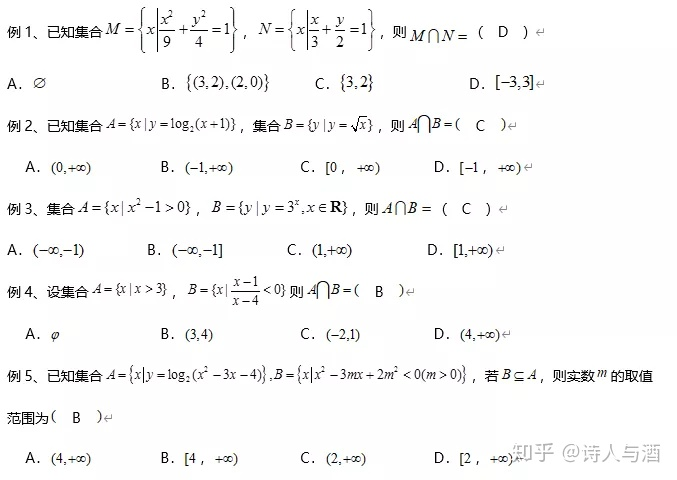--->

1. 已知集合$M=\{x|\dfrac{x^2}{9}+\dfrac{y^2}{4}=1\}, N=\{x|\dfrac{x}{3}+\dfrac{y}{2}=1\}$, 则 $M\cap N =(\;D\;)$
   $A. \; \varnothing \qquad B.\; \{(3,2),(2,0)\} \qquad C.\;\{3,2\} \qquad D.\; [-3,3]$  
2. 已知集合$A=\{x|y=\log_2(x+1)\}$, 集合 $B=\{y|y=\sqrt x\}$, 则 $A\cap B=(\;C\;)$
   $A.\;(0,+\infty) \qquad B.\;(-1,+\infty) \qquad C.\;[0,+\infty) \qquad D.\;[-1,+\infty)$  
3. 集合 $A=\{x|x^2-1>0\}, B=\{y|y=3^x, x\in R\}$, 则 $A\cap B=(\;C\;)$
   $A.\;(-\infty,-1) \qquad B.\;(-\infty,-1] \qquad C.\;(1,+\infty) \qquad D.\; [1,+\infty)$
4. 设集合 $A=\{x|x>3\}, B=\{x|\dfrac{x-1}{x-4}<0\}$, 则 $A\cap B=(\;B\;)$  
   $A. \; \varnothing \qquad B.\;(3,4) \qquad C.\;(-2,1) \qquad D.\;(4,+\infty)$
5. 已知集合 $A=\{x|y=log_2(x^2-3x-4)\}, B=\{x|x^2-3mx+2m^2<0 \; (m>0)\}$, 若 $B\subseteq A$, 则实数 $m$ 的取值范围为 $(\;B\;)$
   $A.\;(4,+\infty) \qquad B.\;[4,+\infty) \qquad C.\;(2,+\infty) \qquad D.\;[2,+\infty)$

## 1.2 常用逻辑语小题

### 历年考情：

2017年在复数题中涉及**真命题**这个概念．这个考点包含的小考点较多，并且容易与函数、不等式、数列、三角函数、立体几何交汇，热点就是“**充要条件**”；难点：否定与否命题；冷点：全称与特称（2015 考的冷点），思想：逆否．要注意，这类题可以分为两大类，一类只涉及形式的变换，比较简单，另一类涉及命题真假判断，比较复杂。

简单叙述：**小范围是大范围的充分不必要；大范围是小范围的必要不充分。**

### 高考预测：

6. 命题“$\forall x\in R, x^2-x+1\geq0$”的否定是 $(\;B\;)$  
   $A.\;\forall x\in R,x^2-x+1<0 \qquad B.\;\exist x_0\in R,x_0^2-x_0+1<0$  
   $C.\;\exist x_0\in R,x_0^2-x_0+1 \geq 0 \qquad D.\;\exist x_0\in R,x_0^2-x_0+1 \leq 0$  
7. 设 $a,b,c$ 为正数，则 "$a+b>c$" 是 "$a^2+b^2>c^2$" 的 $(\;B\;)$  
   $A.充分不必要条件 \qquad B. 必要不充分条件 \qquad C. 充要条件\qquad D. 既不充分也不必要条件$
8. 以下说法错误的是 $(\;D\;)$  
   A. 命题“若$x^2-3x+2=0$,则$x=1$” 的逆否命题为 “若 $x\neq 1$,则 $x^2-3x+2\neq 0$”  
   B. “$x=2$” 是 “$x^2-3x+2=0$” 的充分不必要条件  
   C. 若命题$p:$ 存在$x_0\in R$,使得 $x_0^2-x_0+1<0$, 则 $\neg p:$ 对任意 $x\in R$, 都有$x^2-x+1\geq 0$  
   D. 若$p$且$q$为假命题，则 $p,q$均为假命题
   
<!---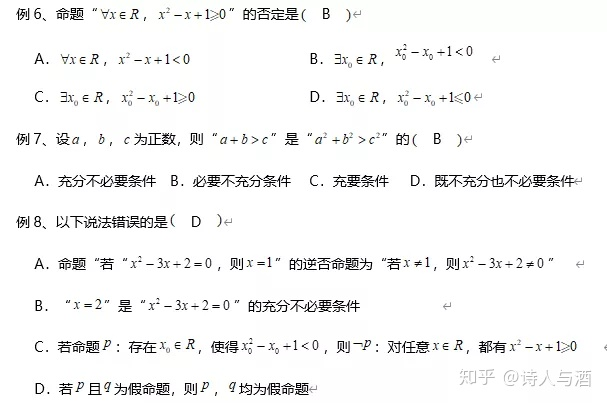--->

# 2. 复数小题

## 历年考情：

高考几乎每年1道复数小题，考查四则运算为主，偶尔与其他知识交汇，难度较小．考查代数运算的同时，主要涉及考查概念有：实部ReZ、虚部ImZ、共轭复数$\bar z=x-iy$、复数的模$|z|=\sqrt{z\cdot \bar z}$、对应复平面的点坐标$(x,y) \leftrightarrow z=x+iy$、复数运算等。

无法直接计算时可以先设$z=a+bi$

## 高考预测：

9. 复数 $z=\dfrac{2-i}{1+i}$ (其中$i$是虚数单位)，则$z$的共轭复数 $\bar z=(\;C\;)$  
    $A. \; \dfrac{1}{2}-\dfrac{3}{2}i \qquad B.\;-\dfrac{1}{2}-\dfrac{3}{2}i \qquad C.\;\dfrac{1}{2}+\dfrac{3}{2}i \qquad D.\;-\dfrac{1}{2}+\dfrac{3}{2}i$
10. 已知$z$的共轭复数是 $\bar{z}$, 且$|z|=\bar{z}+1-2i (i$为虚数单位),则复数$z$在复平面内对应的点位于$(\;D\;)$  
    A. 第一象限 B. 第二象限 C. 第三象限 D. 第四象限

<!---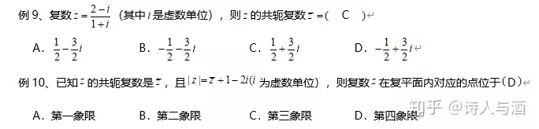--->

# 3. 平面向量小题

## 历年考情：
历年高考中，向量题都是考的基础题，突出向量的几何运算或代数运算，不侧重于与其他知识交汇，难度不大，有利于考察向量的基本运算，符合考试说明。

数量积（点积）问题有坐标时，按照坐标计算为 $\vec{a}\cdot\vec{b}=x_1x_2+y_1y_2$, 没有坐标时，按照模运算为 $\vec{a}\cdot\vec{b}=|\vec{a}||\vec{b}|\cos\theta$.

可以建立坐标系直接建立坐标系，如直角三角形、等腰三角形、等边三角形、矩形、正方形、直角梯形等。

投影问题记牢运算公式 $|\vec{b}|\cos\theta=\dfrac{\vec{a}\cdot\vec{b}}{|\vec{a}|}$.

通过三角形法则和平行四边形法则转化很重要；单位向量要看清，模为1；向量夹角为锐角，数量积大于0，且向量不能同向（夹角为0°）；向量夹角为钝角，数量积小于0，且向量不能反向(夹角为$\pi=180°$)；两个向量不共线才可以作为基底；多个向量和差模先平方后开方。

<!---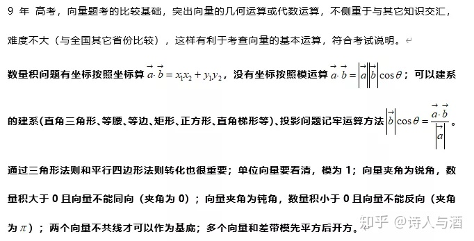--->

## 高考预测：

11. 已知$i$与$j$为互相垂直的单位向量，$a=i-2j, b=i+\lambda j$,且 $a$与$b$的夹角为锐角，则实数 $\lambda$ 的取值范围 $(\;C\;)$  
    $A.\;(-2,\dfrac{2}{3})\cup (\dfrac{2}{3},+\infty) \qquad B.\;(\dfrac{1}{2},+\infty) \qquad C. \;(-\infty,-2)\cup(-2,\dfrac{1}{2}) \qquad D.\;(-\infty,\dfrac{1}{2})$
12. 已知向量 $\vec{a},\vec{b}$ 满足 $|\vec{a}|=2,|\vec{b}|=\sqrt{2}$, 且 $\vec{a}\bot(\vec{a}+2\vec{b})$,则 $\vec{b}$在$\vec{a}$ 方向上的投影为 $(\;D\;)$  
    $A.\; 1 \qquad B.\; -\sqrt{2} \qquad C.\; \sqrt{2} \qquad D.\; -1$
13. 已知平面向量$\vec{a},\vec{b}$的夹角为$\dfrac{\pi}{3}$, 且$|\vec{a}|=1,|\vec{b}|=2$, 则$2\vec{a}+\vec{b}$ 与 $\vec{b}$ 的夹角为 $(\;D\;)$  
    $A.\;\dfrac{5\pi}{6} \qquad B.\;\dfrac{2\pi}{3} \qquad C.\;\dfrac{\pi}{3} \qquad D. \;\dfrac{\pi}{6}$
14. 已知平面向量$\vec{a},\vec{b}$的夹角为$30\degree$, $|\vec{a}|=\sqrt{3},|\vec{b}|=2, 则 |\vec{a}+2\vec{b}|=(\;\sqrt{31})$ 
15. 两个不共线向量$\overrightarrow{OA},\overrightarrow{OB}$的夹角为$\theta$, $M,N$分别为线段 $OA,OB$的中点，点$C$在直线$MN$上，且$\overrightarrow{OC}=x \overrightarrow{OA}+y \overrightarrow{OB}\;(x,y \in R)$, 则 $x^2+y^2$的最小值为$(\;\dfrac{1}{8}\;)$ 
16. 已知$\triangle ABC$是边长为2的等边三角形，$D$为$BC$的中点，且 $\overrightarrow{BP}=\dfrac{2}{3}\overrightarrow{BC}$, 则 $\overrightarrow{AD}\cdot\overrightarrow{AP}=(\;B\;)$  
    $A.\;\dfrac{\sqrt{3}}{2} \qquad B.\;1 \qquad C.\; \sqrt{3} \qquad D.\;3$
17. 在平行四边形$ABCD$中，$AB=2,AD=4,\overrightarrow{AB}\cdot\overrightarrow{AD}=4, E$为$AB$的中点，则 $\overrightarrow{CE}\cdot\overrightarrow{BD}=(\;C\;)$  
    $A.\;-4 \qquad B.\;-8 \qquad C.\; -12 \qquad D.\; -16$
 
<!---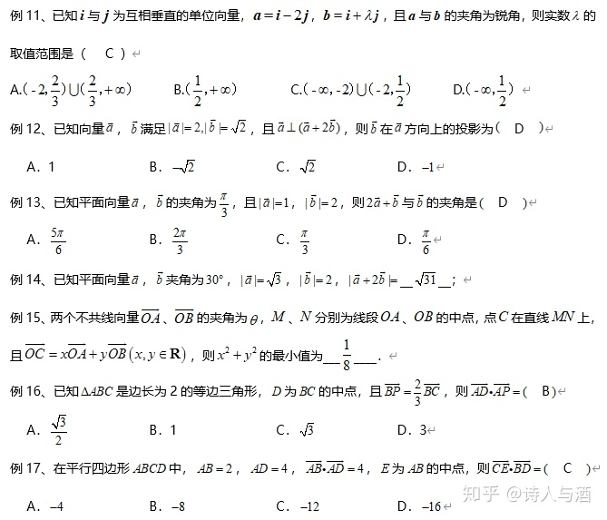-->

# 4. 线性规划小题

## 历年考情：

全国卷线性规划题考的比较基础，一般不与其它知识结合，不象部分省区的高考向量题侧重于与其它知识交汇，如和平面向量、基本不等式、解析几何等交汇．这种组合式交汇意义不大，不利于考查基本功．由于线性规划的运算量相对较大，难度不宜太大，不过为了避免很多同学解出交点代入的情况估计会加大“形’的考察力度，有可能通过目标函数的最值作为条件反求可行域内的参数问题，或者利用一些含有几何意义的目标函数（斜率、距离等）， 如 2015 年新课标 15 题。平移目标函数最准确

三大常见考法：截距型、斜率型、距离型；斜率型注意范围是取中间还是取两边；距离型最小值注意是点点距离最小还是点线距离最小。

含参问题包括约束条件含参和目标函数含参，注意动变静、动静结合；面积问题。

## 高考预测：

18. 已知$x,y$满足约束条件 $\begin{cases}
  x-y+3 \leq 0\\
  3x+y+5 \leq 0\\
  x+3 \geq 0
\end{cases}$, 则 $z=x+2y$ 的最大值是 $(\;C\;)$   
   $A.\;0 \qquad B.\;2 \qquad C.\;5 \qquad D.\;6$

19. 已知不等式组 $\begin{cases}
  x-1 \geq 0\\
  kx-y \leq 0\\
  x+\sqrt{3}y-3\sqrt 3 \leq 0
\end{cases}$ 表示的平面区域为等边三角形, 则 $z=x+3y$ 的最小值为 $(\;D\;)$   
   $A.\;2+3\sqrt{3} \qquad B.\; 1+3\sqrt{3} \qquad C.\; 2+\sqrt{3} \qquad D.\; 1+\sqrt{3}$

20. 已知不等式组 $\begin{cases}
  x-y+k \geq 0\\
  3x-y-6 \leq 0\\
  x+y+6 \geq 0
\end{cases}$ 表示的平面区域恰好被圆 $C: (x-3)^2+(y-3)^2=r^2$所覆盖, 则 实数$k$ 的值为 $(\;D\;)$   
   $A.\;3 \qquad B.\; 4 \qquad C.\; 5 \qquad D.\; 6$

21. 如果点 $P(x,y)$ 满足$\begin{cases}
  2x-y+2 \geq 0\\
  x-2y+1 \leq 0\\
  x+y-2 \leq 0
\end{cases}$, 点$Q$在曲线$x^2+(y+2)^2=1$上，则$|PQ|$的取值范围是$(\;D\;)$   
   $A.\;[\sqrt{5}-1,\sqrt{10}-1]  \qquad B.\; [\sqrt{5}-1,\sqrt{10}+1] \qquad C.\; [\sqrt{10}-1,5] \qquad D.\; [\sqrt{5}-1,5]$

22. 已知 $x>0,y>0$, 且 $\dfrac{1}{x}+\dfrac{2}{y}=1$, 则 $xy+x+y$的最小值为$(\;7+4\sqrt{3}\;)$ 

<!---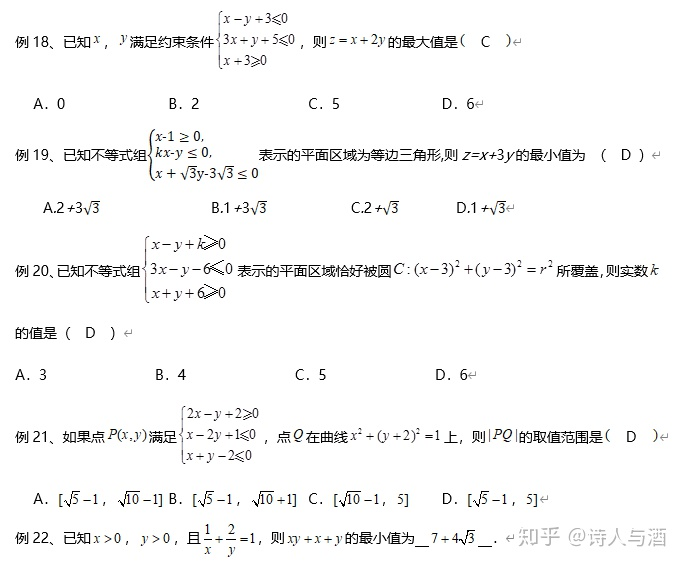--->

# 5. 三角函数小题

## 历年考情：

每年高考至少 1 题．题目难度较小，主要考察公式熟练运用、平移、图像性质、化简求值、解三角形等问题（含应用题），基本属于“送分题”．小心平移（重点+难点+几乎年年考）．2013 年 15题对化简要求较高，难度较大2016年和2018年的考法也是比较难的，所以当了压轴题。2019年选择题2道题涉及三角函数，主要考查三角函数的图像性质。

三角函数的定义式：会巧妙利用定义求解 $\sin,\cos,\tan$, 但要注意正负；熟练诱导公式、两角和与差公式、倍角公式、辅助角公式，符号问题太重要；牢记 $\sin,\cos,\tan$ 的图像性质；整体思想。

出现 $-\dfrac{\pi}{2},\dfrac{\pi}{2},\pi,\dfrac{3}{2}\pi, 2\pi$ 等的时候，记着用诱导公式，其他角的形式用两角和与差公式展开或合并；$\sin^2\alpha,\cos^2\alpha$ 用降幂公式的较多；巧妙选择倍角公式进行凑角和转化；巧妙选择两角和与差公式进行凑角和转化。

$\sin(\omega x+\varphi)=1, \implies \omega x+\varphi=\dfrac{\pi}{2}+2k\pi;\quad \cos(\omega x+\varphi)=1, \implies \omega x+\varphi=2k\pi;$  
$\sin(\omega x+\varphi)=-1, \implies \omega x+\varphi=-\dfrac{\pi}{2}+2k\pi;\quad \cos(\omega x+\varphi)=-1, \implies \omega x+\varphi=\pi+2k\pi;$  
$\sin(\omega x+\varphi)=0, \implies \omega x+\varphi=k\pi; \quad \cos(\omega x+\varphi)=0, \implies \omega x+\varphi=\dfrac{\pi}{2}+k\pi;$

$f(x)=\sin(\omega x+\varphi)$时，求对称轴，则$\omega x+\varphi=\dfrac{\pi}{2}+2k\pi$; 求对称中心，则$\omega x+\varphi=k\pi,$求出$x$为横坐标，纵坐标为0.

$f(x)=\cos(\omega x+\varphi)$时，求对称轴，则$\omega x+\varphi=k\pi$; 求对称中心，则$\omega x+\varphi=\dfrac{\pi}{2}+k\pi,$求出$x$为横坐标，纵坐标为0.

选择题验证对称轴的方法：将选项中的直线 $x=\cdots$ 代入解析式，若 $\sin$ 或 $\cos$ 取得$\pm 1$ (最大值和最小值) 就是对称轴；

选择题验证对称中心的方法：将选项中的点代入解析式，横坐标都成立则为对称中心；  
$f(x)=A\sin(\omega x+\varphi)+B, (A>0,\omega>0)$求解思路：$A+B=$最大值，$-A+B=$最小值；$\omega=\dfrac{2\pi}{T}$； 代入求$\varphi$, 多个$\varphi$值满足要求时，可以通过 $f(0)=A\sin\varphi$的正负进行判断；   
单调区间的求解必须保证 $\omega x$ 为正。

<!---
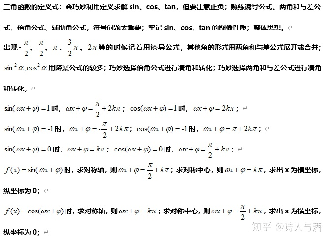
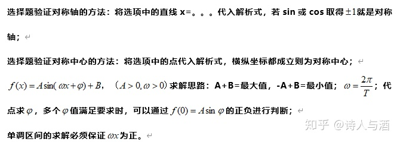
--->

## 高考预测：

23. 已知 $x\in (0,\dfrac{\pi}{2}), \cos(x+\dfrac{\pi}{4})=\dfrac{3}{5}$, 则 $\sin x$ 的值为 ( B )   
    $A.\;-\dfrac{\sqrt{2}}{10} \qquad B.\;\dfrac{\sqrt{2}}{10} \qquad C.\;\dfrac{7\sqrt{2}}{10} \qquad D.\; -\dfrac{7\sqrt{2}}{10}$
24. 已知 $\alpha$ 为锐角，且 $\tan \alpha = \dfrac{4}{3}$, 则 $\cos(2\alpha+\dfrac{\pi}{2})=(\;A\;)$    
    $A.\;-\dfrac{24}{25} \qquad B.\;-\dfrac{16}{25} \qquad C.\;\dfrac{3}{5} \qquad D.\;\dfrac{3}{4}$

25. 已知 $\sin(\alpha+2\beta)=\dfrac{3}{4}, \cos(\beta)=\dfrac{1}{3}, \alpha,\beta$ 为锐角，则 $\sin(\alpha+\beta)$ 的值为（ D ）   
    $A.\;\dfrac{3\sqrt{7}-2\sqrt{2}}{12} \qquad B.\;\dfrac{3-2\sqrt{14}}{12} \qquad C.\;\dfrac{3\sqrt{7}+2\sqrt{2}}{12} \qquad D.\;\dfrac{3+2\sqrt{14}}{12}$
26. 设 $\alpha \in(0,\dfrac{\pi}{2}), \beta\in(0,\dfrac{\pi}{2})$, 且 $\cos\beta=\tan\alpha(1+\sin\beta)$, 则 （ D ）   
    $A.\;\alpha-\beta=\dfrac{\pi}{4} \qquad B.\;\alpha+\beta=\dfrac{\pi}{2} \qquad C.\; 2\alpha-\beta=\dfrac{\pi}{2} \qquad D.\; 2\alpha+\beta=\dfrac{\pi}{2}$
27. 在平面直角坐标系 $xOy$ 中，角$\alpha$的顶点为坐标原点，始边与$x$轴的非负半轴重合，终边交单位圆$O$于点$P(a,b)$, 且 $a+b=\dfrac{7}{5}$, 则 $\cos(2\alpha+\dfrac{\pi}{2})$的值是 （$\dfrac{24}{25}$）
28. 已知 $f(x)=A\sin(\omega x+\varphi)+B \;(A>0, \omega >0, |\varphi|<\dfrac{\pi}{2})$的部分图像如图，则 $f(x)$ 的一个对称中心是 （ D ）   
    $A.\;(\pi,0) \qquad B.\; (\dfrac{\pi}{12},0) \qquad C.\; (-\dfrac{5\pi}{6},-1) \qquad D.\;(-\dfrac{\pi}{6},-1)$
29. 已知函数 $f(x)=A\sin(\omega x+\varphi) \;(A>0, \omega >0, |\varphi|<\pi)$的部分图像如图所示，则 函数$g(x)=A\cos(\omega x+\varphi)$ 的一个对称中心可能是 （ C ）   
    $A.\;(-2,0) \qquad B.\;(1,0) \qquad C.\;(10,0) \qquad D.\;(14,0)$
30. 已知 $f(x)=\sin\omega x+\sqrt{3}\cos\omega x\;(\omega>0)$在区间 $[\dfrac{\pi}{6},\dfrac{\pi}{4}]$ 上单调递增，则的取值范围是 （ B ）       
31. 
32. 
33. 

<!---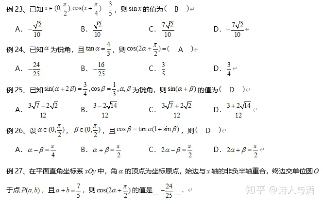--->
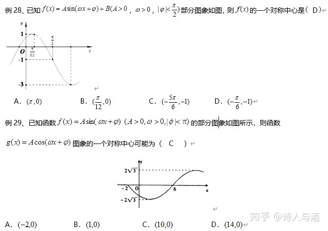
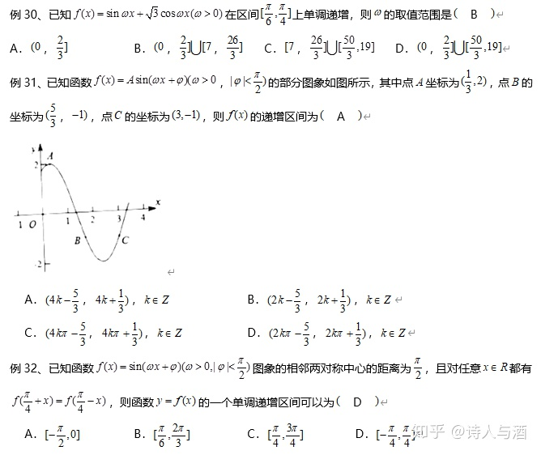

# 6. 立体几何小题

## 历年考情：

历年高考，一般考三视图和球，主要计算体积和表面积．其中，我认为“点线面”也有可能出现在小题，但是难度不大，立体几何是否会与其它知识交汇？如：几何概型？有可能．但是，根据全国卷的命题习惯，交汇可能性不大．除2019年外，年年考三视图，是否也太稳定了吧？球体是基本的几何体，是发展空间想象能力的很好载体，是新课标的热点，但有时难度较大。

三视图要学会在长方体或正方体或直棱柱等特殊几何体中截取，对某些棱不确定时多尝试进而验证；要牢记三棱锥、三棱柱、圆柱、圆锥、长方体、正方体、球等常见图形的三视图，多联想；

可以补形为长方体或正方体时候，按照长方体或正方体外接球解决比较简单；直三棱柱或正三棱柱也是这样；其他无法补形的几何体外接球球心找法：从两个面（尽量是等边、等腰、直角等特殊的面）的外心作面的垂线，两条垂线的交点就是球心，然后要在两条垂线构成的平面中解决问题。

## 高考预测：

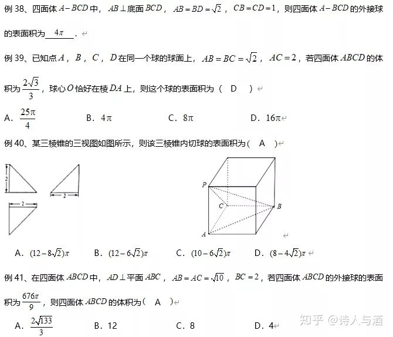

# 7. 推理证明小题

## 历年考情：

9 年高考，这不是常规的数学考法，倒是很像一道公务员考试的逻辑推理题，但这是个信号，2016 年和 2017 年全国Ⅱ卷又连续两次考。

# 8. 概率小题

## 历年考情：

历年高考，2013 年没考小题，但是在大题中考了．主要考古典概型、几何概型和相互独立事件的概率。

长度型、面积型、体积型、角度型

## 高考预测：
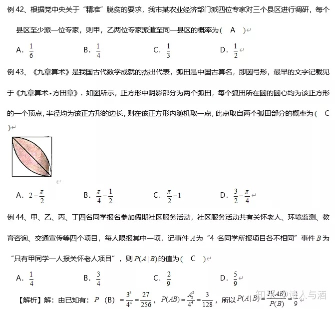

# 9. 统计小题

## 历年考情：

9 年高考，只在 2013 年和 2018 年考了统计小题．统计一般放在大题考，这个考点内容实在太多：频率分布表、直方图、抽样方法、样本平均数、方差、标准差、散点图、回归分析、独立性检验等。

正相关、负相关、完全相关、相关系数、样本中心点、频率分布直方图和频数分布表中的平均数及中位数。

## 高考预测：
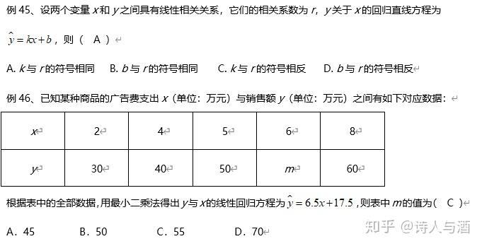

# 10. 数列小题

## 历年考情：

 历年高考，全国Ⅰ理数的数列解答题和三角函数解答题每年只考一个，考解答题时一般不再考小题，不考解答题时，就考两个小题，一般等差数列和等比数列各一个．难度上看，一般会有一个比较难的的小题，如 2013 年的 12 题，2012 年 16 题，2017年 12 题，它们都是压轴题。

理科数学2016、2017、2018、2019连续四年没有考查数列解答题，都是以选择填空形式出现。

等差等比用通项公式和前n项公式，等比问题学会作比值化简；累加法、累乘法个构造法要掌握类型特点；

特别注意$S_n$和 $a_n$的关系，$a_n=\begin{cases}
    S_n, & n=1 \\
    S_n-S_{n-1}, & n>2
\end{cases}$, 两个方向都可以转化；分组求和、裂项相消法和错位相减法要看清楚通项的形式，并注意收尾项；$a_1,d,q,a_n,S_n$ 等基本量的求解很重要，多解问题要多次验证进行取舍。

## 高考预测：
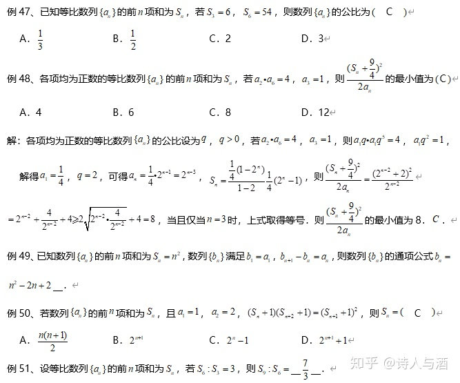

# 11. 框图小题

## 历年考情：

历年高考,2018年没有考2011 -2017和2019年每年1题!考含有循环体的较多，都比较简单，考查填写循环语句也较多，一般与数列求和联系较多，难度不大。

# 12. 直线、圆和圆锥曲线小题

## 历年考情：

直线和圆的小题很少单独考查，基本都要结合其他知识交叉考查；圆锥曲线小题中，历年高考每年2题！太稳定了！太重要了！！全国卷注重考查基础知识和基本概念，综合一点的小题侧重考查圆锥曲线与直线位置关系，多数题目比较单一。**数形结合很重要**。

**直线与圆相交的弦长问题要结合点线距离和勾股定理（垂径定理）**。

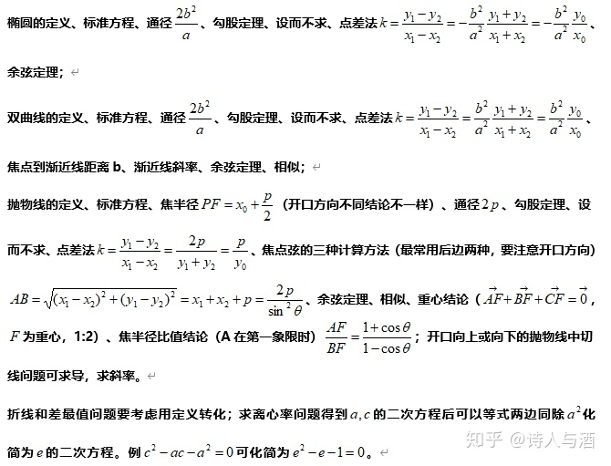

## 高考预测：

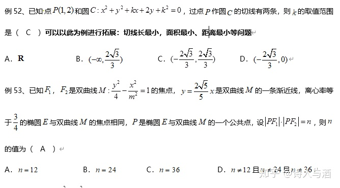
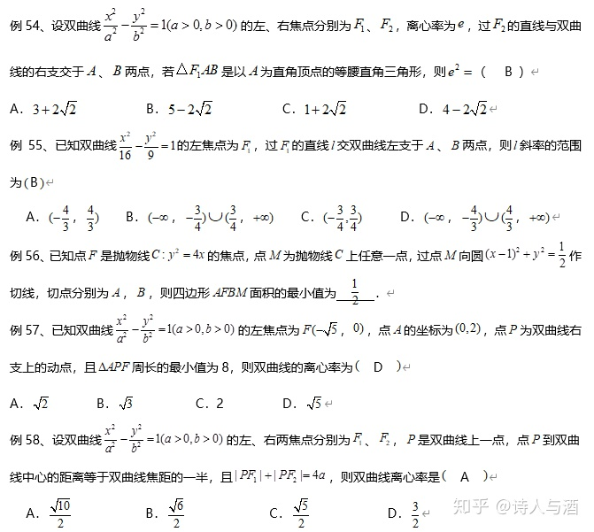
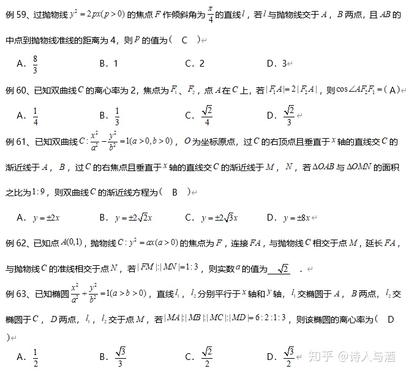

# 13. 函数小题

## 历年考情：

历年高考，主要考查：定义域、最值、单调性、奇偶性、周期性、对称性、平移、导数、切线、定积分、零点等，分段函数是重要载体！绝对值函数也是重要载体！函数已经不是值得学生“恐惧”的了吧？零点问题数形结合很重要。

牢记周期性和对称性的结论；注意单调性和奇偶性的关系；学会用特殊点巧解；隐藏性质：奇函数在原点处有定义时，；常见奇偶函数的特殊形式（总结过的）；比较大小单调性和中间变量相结合。图像选择四部曲：定义域奇偶性特殊点单调性（求导数），特殊点最关键。

## 高考预测：

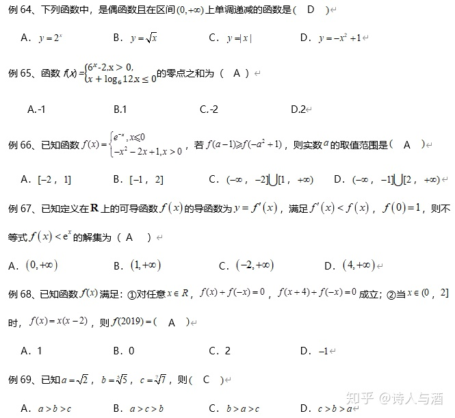
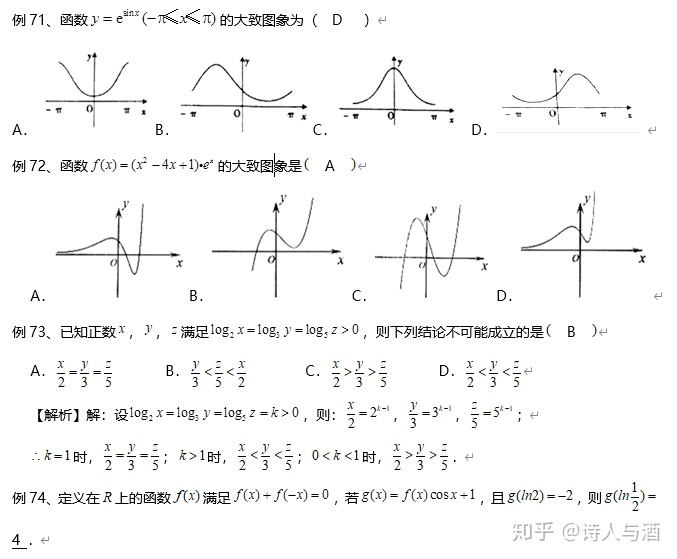
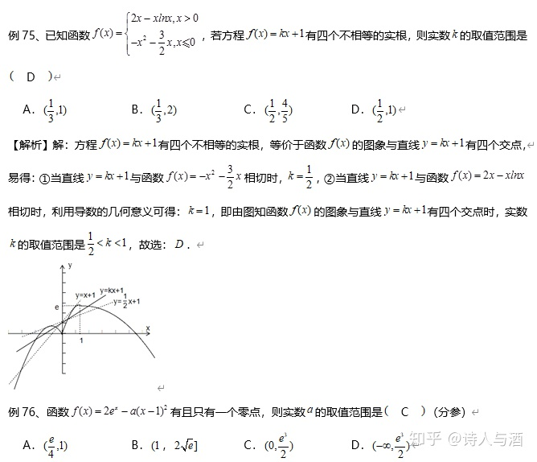
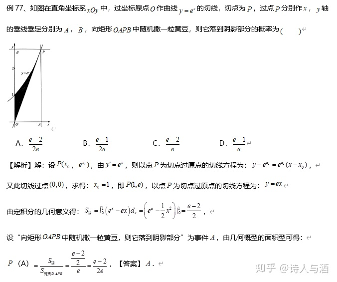
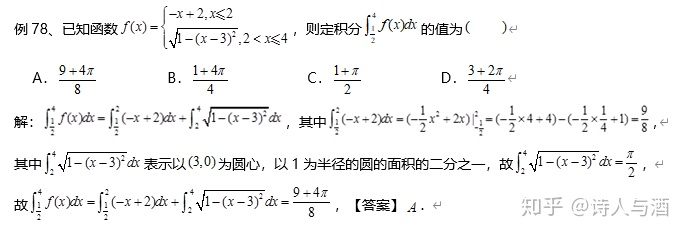

# 14. 排列组合、二项式定理

## 历年考情：

历年高考，二项式定理出现较多，这一点很合理，因为排列组合可以在概率统计和分布列中考查．排列组合考题的难度不大，无需投入过多时间（无底洞），而且排列组合难题无数，只要处理好分配问题及掌握好分类讨论思想即可！二项式定理“通项问题”出现较多。赋值法不要忘记。

注意定积分和二项式的交叉考查

## 高考预测：

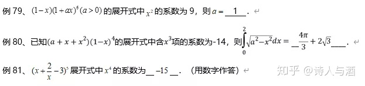