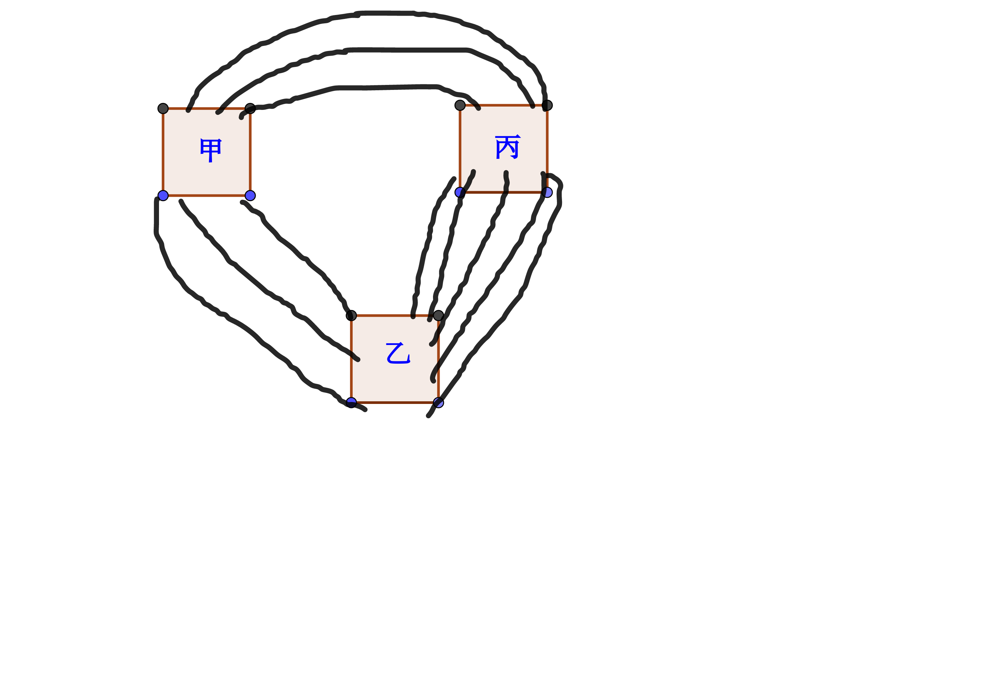
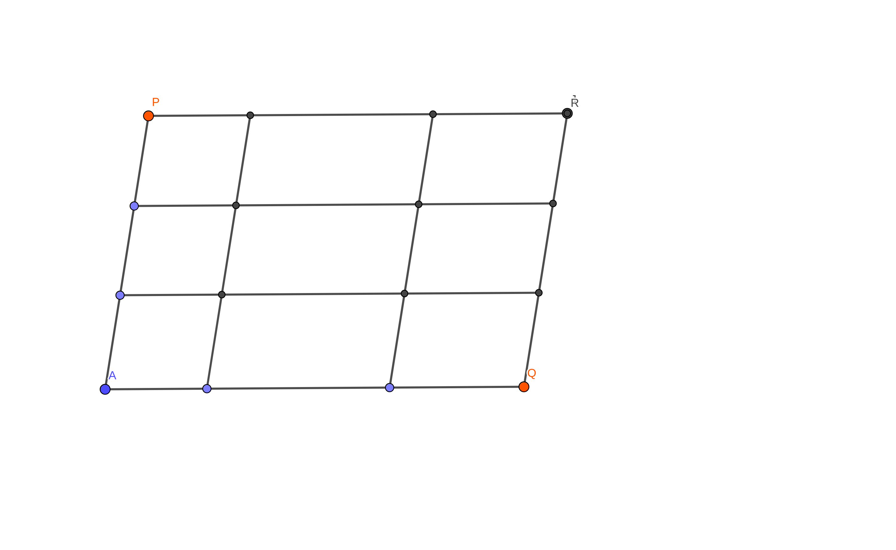
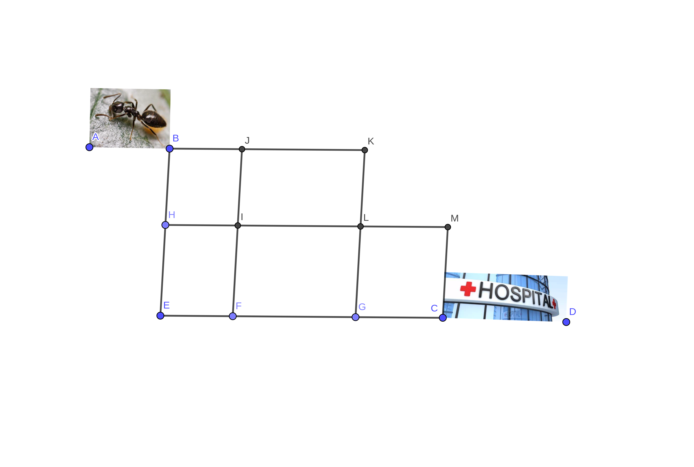

Date: June 22 2020  
Grade: Two  
Course: Math  

# 每个汉字代表一个整数

$$我爱数学\\
 × \qquad 9\\ 
 ——————\\
   学数爱我
$$

结果是： `我=____, 爱=____, 数=____, 学=____,`

# 补充完整竖式计算

$$\Large \quad\square \;4\\
\times 3 \; \square\\
—————— \\ 
\square \;2\; 0\\
\square \;\square \;\square \qquad \\
——————\\
1\; 5\; \square \; \square\quad
$$

# 从甲地到丙地，一共有($\quad$  )不同的路线

# 从A到B共有($\quad$)条不同的最短路线

# 蚂蚁看病，有($\quad$)种不同的最短路径图

# 找规律填数

$$\Large \dfrac{4}{5},\quad \dfrac{6}{9},\quad \dfrac{9}{15},\quad \dfrac{13}{23},\quad \dfrac{\square}{\square}$$

