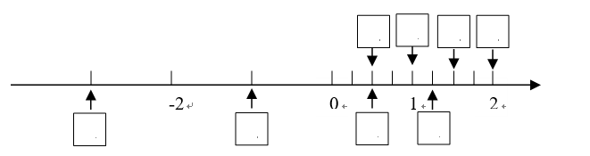
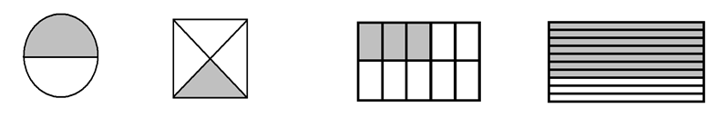

# 小学数学小数练习题-4

## 一、判断题

1. 小数都比1小  　　　　　　　　　　　$(　　 )$
2. 小林身高是11.4米 　　　　　　　　 $(　　 )$
3. 0.14读作:零点十四　　　　　　　　　$(　　 )$
4. 0.1是 **1** 的十分之一, 是 **0.01** 的10倍　　$(　　 )$
5. 把6写成两位小数是 **0.06** 　　　　　　$(　　 )$
6. 准确数大于近似数　　　　　　　　$(　　 )$
7. 近似数2.0和近似数2一样大　　　　$(　　 )$
8. 7.295保留两位小数后是7.3　　　　$(　　 )$
9. 小数都比整数小 　　　　　　　　$(　　 )$

## 二、填空

1. 保留$(\qquad)$位小数，表示精确到十分位, 保留三位小数，表示精确到$(\qquad)$位．
2. 把 **1520000** 改写成“万”作单位的数是$(\qquad)$, 1亿改写成以个位为单位的数是$(\qquad\qquad)$.
3. **$3.995≈4.00$**，表示精确到$(\qquad)$位．
4. 比较大小   
$15.08 \square 16 \qquad  1.5 \square 1.50 \qquad   0.07 \square 0.70  \qquad 0.46 \square 0.464 \qquad  4.020 \square 4.002$
5. 在小数的$(　　 )$添上零或者去掉零, $(　　 )$不变．
6. **0.48** 里面有(　　 )个十分之一, (　　 )个百分之一．
7. **1** 里面有(　　 )个0.1, 0.1里面有(　　 )个0.001．
8. **4个十分之一, 9个百分之一**, 组成的数是(　　 ), 它的计数单位是(　　 )．
9. 化简下面小数, 保持数值不变．   
$0.30＝(　 ) \qquad  1.350＝(　 )\qquad   140.00元＝(　 )\qquad   0.2400＝(　 )$
10. 与 **5.7** 相邻的两个整数分别是(　　 ), (　　 )．
11. 零点二零五, 写作:(　　 ), 保留一位小数约是(　　 )．
12. **2.508** 读作: (　           　 ), 这个小数四舍五入到百分位约是(　　 )
13. 写出两个大于5, 小于6的一位小数(　　 ), (　　 )．
14. **3.45** 这个数中, 3在(　　 )位上, 表示(　　 )个(　1　 ), 4在(　　 )位上,表示 4 个(　　 ), 5在(　　 )位上, 表示 5 个(　　 )．
15. 在括号里填上适当的整数或小数.   
0.65元=(　　)角(　　)分, 3.6平方米=(　　)平方米(　 )平方分米，   
800千克=(　　)吨 , 1米3分米=(　 )米, 2.05千米=(　 )千米(　 )米，   
1米2分米5厘米＝(　 )米,  1千克50克＝(　)千克, 150公顷=(　)平方千米。
16. 在15、0.33……、8.25、0、1、0.423 这六个数中，整数有（　　　　），自然数有（　　　　），小数有（　　　　　　），有限小数有（　　　　），循环小数有（　　　　）。
17. 把 $0.\dot{5}\dot{4}, 0.5\dot{4}$, 5.4％, $\dfrac{11}{20}$, 0.54按从小到大的顺序排列为：  
    $（　　　　　　　　　　　　　　　　　　　　）$
18. 循环小数0.1234512345……用简便方法记作（　　　　），它的小数部分第19位上的数字是（　）。
19. 某个自然数除以2、3、4、5结果都余1，这样的数有（　）个，最小的是（　）。
20. 一个小数的小数点向左移动一位，所得的数比原来的数小3.24，原来的小数是（　　）。
21. 在直线下面的 $\square$ 里填整数或小数，上面的 $\square$ 里填分数。

22. 把下面各小数四舍五入     
  （1）精确到十分位：   
    $1.04≈\qquad        3.45≈\qquad          6.96≈$   
  （2）精确到百分位：    
    $0.372≈\qquad      10.503≈\qquad         9.495≈$

23. （1）把 **315000** 改写成用“万”作单位的数，再保留整数．    
    $\\[1em]$

    （2）把 **1927600000** 吨改写成用“亿吨”作单位的数，再保留两位小数．
    $\\[1em]$

24. 把下面各数化成百分数：    
$0.27＝\qquad              1.52＝\qquad           0.5＝\qquad             0.08＝\\
3.28＝\qquad             10.06＝\qquad            32＝\qquad            0.005＝$

25. 把下面百分数化成小数或整数   
$52\%＝\qquad 1.23\%＝\qquad 248\%＝\qquad 70\%＝\\
0.4\%＝\qquad 15\%＝\qquad 100\%＝\qquad 2000\%＝$
 
26. 分别用分数、小数、百分数表示下面各图中的阴影部分

    

    分  数（　　）　　  分  数（　　　）　　     分  数（　　）　　  分  数（　　　）   
    小  数（　　）　　  小  数（　　　）　　     小  数（　　　）　　  小  数（　　　）   
    百分数（　　）　　  百分数（　　　）　　      百分数（　　　）　　  百分数（　　　）  

27. 在括号里填上“＞”、“＜”或“＝”   
$0.67(　　)67\% \qquad     31.3(　　)313\% \qquad     260\%(　　)2.6 \qquad  \dfrac{10}{10} (　　)100\%\\
1\% (　　)0.1 \qquad     0.25(　　)25\% \qquad       50\%(　　)\dfrac{1}{2} \qquad    0.3(　　)0.3\%$ 

**注：**    
$1平方千米=1千米\times 1千米=1000米\times 1000米=1,000,000平方米=10^6平方米\\ 
1公顷=10,000平方米=10^4平方米 \\
所以 1平方千米=100公顷=10^2公顷$
