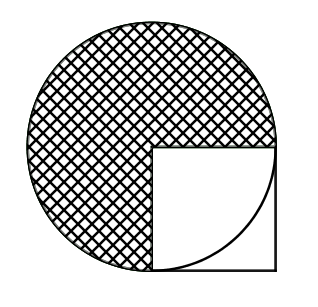

# 分数乘除法综合练习题（五）

## 一、直接写得数

$\dfrac{5}{7} ×\dfrac{3}{4}=\qquad\qquad \dfrac{7}{9} \div \dfrac{9}{7} =\qquad\qquad \dfrac{6}{5} ×\dfrac{4}{3}=\qquad\qquad \dfrac{5}{7} \div \dfrac{15}{2} =\qquad\qquad \dfrac{8}{9}× \dfrac{3}{4} =\\[2em]$

$\dfrac{5}{6}\div 1 =\qquad\qquad \dfrac{19}{20} × \dfrac{15}{38} =\qquad\qquad \dfrac{9}{10} \div\dfrac{3}{2}=\qquad\qquad \dfrac{1}{5}-\dfrac{1}{6} =\qquad\qquad \dfrac{4}{7} × 1 =\\[2em]$

$\dfrac{1}{2}+\dfrac{1}{7} =\qquad\qquad \dfrac{19}{67} × 0 =\qquad\qquad 8 \times\dfrac{7}{8}=\qquad\qquad 63 \div\dfrac{7}{9} =\qquad\qquad \dfrac{1}{4}+\dfrac{3}{5} =\\[2em]$

$\dfrac{5}{6}\div \dfrac{5}{6} =\qquad\qquad 10\div 10\% =\qquad\qquad 12 \div\dfrac{2}{3}=\qquad\qquad 1.8 \times \dfrac{1}{6} =\qquad\qquad \dfrac{5}{6} × \dfrac{9}{10} \times \dfrac{2}{5} =\\[2em]$

## 二、看谁算得快

$\dfrac{5}{8}\div \dfrac{16}{7} \div \dfrac{14}{11}  =\qquad\qquad \dfrac{3}{8} × \dfrac{5}{6} \times \dfrac{24}{35} =\qquad\qquad \dfrac{19}{26} \div\dfrac{38}{55}\times\dfrac{5}{11}=\qquad\qquad 12\div\dfrac{3}{5}\times\dfrac{3}{25} =\qquad\qquad \dfrac{3}{8} × 4 \div\dfrac{3}{8}\times 4 =\\[5em]$

$\dfrac{5}{8}\times\dfrac{4}{3}+ \dfrac{5}{8} \div \dfrac{3}{4}  =\qquad\qquad \dfrac{5}{8} \div \dfrac{7}{12} \div \dfrac{7}{10} =\qquad\qquad \dfrac{1}{2} \div\dfrac{5}{4}\times\dfrac{2}{3}=\qquad\qquad 6\div\dfrac{3}{10}-\dfrac{3}{10}\div 6 =\qquad\qquad \dfrac{1}{3} × \dfrac{3}{4} \div (\dfrac{3}{4}-\dfrac{5}{12}) =\\[5em]$

$[\dfrac{5}{3}-(\dfrac{2}{5}+\dfrac{3}{4})] \div \dfrac{31}{4} =\qquad\qquad (\dfrac{7}{8}+\dfrac{13}{6}) \div \dfrac{13}{16} =\qquad\qquad \dfrac{7}{18} \times\dfrac{1}{4}+\dfrac{3}{4}\times\dfrac{7}{18}=\qquad\qquad 14\times\dfrac{5}{7}\div 14\times \dfrac{5}{7} =\qquad\qquad 36\times(\dfrac{7}{9}+ \dfrac{3}{4} - \dfrac{5}{6}) =\\[5em]$

$(\dfrac{4}{9}+\dfrac{1}{23}) \times 9+ \dfrac{14}{23} = \qquad\qquad \dfrac{1}{2}\times 3.2+5.6\times 0.5+1.2 \times 50\% =\qquad\qquad 21 \div (\dfrac{1}{3}+\dfrac{2}{5})\div\dfrac{9}{11}=\qquad\qquad [2-(\dfrac{5}{6}+\dfrac{5}{8})]\times \dfrac{7}{12} =\\[5em]$

## 三、解方程

$\dfrac{7}{8} x =\dfrac{21}{32} \qquad\qquad \dfrac{8}{9} x \div 4=\dfrac{2}{15} \qquad\qquad \dfrac{4}{5} x+ \dfrac{2}{15}x=\dfrac{2}{3} \qquad\qquad \dfrac{5}{6}x  =30 \\[5em]$

$8x-\dfrac{1}{3} = \dfrac{1}{9} \qquad\qquad  6x+5\times 4.4=40 \qquad\qquad (1-60\%)\div x=5 \qquad\qquad \dfrac{1}{2}x+\dfrac{2}{5}x=\dfrac{21}{20}\\[5em]$

## 四、求比值

$1052:87 = \qquad\qquad 467:46.7= \qquad\qquad \dfrac{10}{63}:30=\\[5em]$

$\dfrac{4}{5}:0.6= \qquad\qquad 210:140=\qquad\qquad \dfrac{1}{9}:\dfrac{1}{2}= \\[5em]$

## 五、化简比

$65:13 = \qquad\qquad 123:3= \qquad\qquad 1.1:11=\\[2em]$

$4.9:0.7 = \qquad\qquad \dfrac{1}{2}:\dfrac{5}{6}= \qquad\qquad 15:0.12=\\[2em]$

## 六、列式计算

1．**4** 个 $\dfrac{1}{18}$ 的和除以 $\dfrac{3}{8}$，商是多少？

$\\[5em]$

2． $\dfrac{1}{2}$ 减去 $\dfrac{1}{2}$ 乘 $\dfrac{2}{3}$ 的积，差是多少？

$\\[5em]$

3．一个数的 $\dfrac{5}{6}$ 比它的 $\dfrac{3}{4}$ 多 **4**，求这个数。

$\\[5em]$

4． $\dfrac{1}{2}$ 加上 $\dfrac{2}{3}$ 的和，等于一个数的 $\dfrac{2}{3}$ ，这个数是多少？

$\\[5em]$

5．比一个数多 **12%** 的数是 **112** ，这个数是多少？

$\\[5em]$

## 七、面积计算

已知正方形的面积是 **9** 平方厘米，求阴影部分面积。

