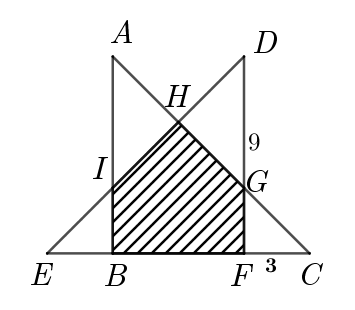

# 小学数学-几何面积模型（三）

FileName:   小学数学-几何面积模型（三）.md

Created Date:      September 10, 2020  

Contact:     kumath@outlook.com

## 9. 复合图形拆分

<!-- 3-1 -->
**例3-1.** 如图，三角形ABC和DEF是两个完全相同的等腰直角三角形，其中DF长9厘米，CF长3厘米，求阴影部分的面积。

解题过程：

[例题3-1解析](ggb/例题3-1.ggb)

练习3-1. 两个正方形如图放置，图中每个三角形都是等腰直角三角形，若其中较小正方形的边长为12厘米，那么较大正方形的面积是多少平方厘米？

[练习3-1解析](practice/练习3-1.ggb)

## 10. 分拆成几何模型求面积

## 总结

![面积模型之二总结.jpg]