# 小学数学-几何面积模型（二）

FileName:   小学数学-几何面积模型（二）.md

Created Date:      September 10, 2020  

Contact:     kumath@outlook.com

## 6. 风筝模型（四边形）

任意凸四边形，被两条对角线分割为四个小三角形。
上下两三角形面积之积等于左右两三角形面积之积。

<!-- 2-1 -->
**例2-1.** 如图，四边形ABCD被两条对角线分成4个三角形，其中三个三角形的面积已知，求：（1）三角形BGC的面积；（2）AG:GC=?

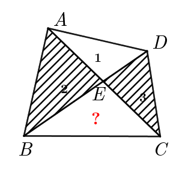

解题过程：

[例题2-1解析](ggb/例题2-1.ggb)

练习2-1. 如图，四边形ABCD中，对角线交于点O，已知AO=1，三角形ABD和CBD的面积之比为 3:5，则 OC 的长是多少？

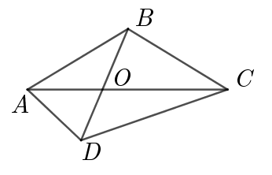

[练习2-1解析](practice/练习2-1.ggb)

<!-- 2-2 -->
**例2-2.** 如图，边长为1的正方形ABCD中，BE=2EC，CF=FD，求三角形AEG的面积

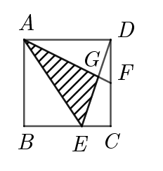

解题过程：

[例题2-2解析](ggb/例题2-2.ggb)

练习2-2. 如图，长方形ABCD中，BE:EC=2:3，DF:FC=1:2, 三角形DFG的面积为 2 平方厘米，求长方形ABCD的面积。

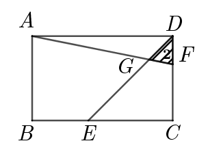

[练习2-2解析](practice/练习2-2.ggb)

## 7. 蝴蝶模型（梯形）

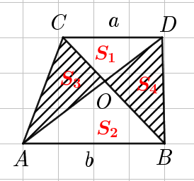

定理还有：  
    $1. \; S_1:S_2 = a^2:b^2\\
    2. \; S_1:S_2:S_3:S_4 = a^2:b^2:ab:ab\\
    3. \; S_3 = S_4 \\
    4. \; S_1 \times S_2 = S_3 \times S_4\\
    5. \; CO:OB=S_1:S_4=S_3:S_2=(S_1+S_3):(S_2+S_4)\\
    6. \; AO:OD = S_2:S_4 = S_3:S_1 = (S_2+S_3):(S_1+S_4)$
   
<!-- 2-3 -->
**例2-3.** 如图，梯形ABCD的AB//CD,对角线AC和BD相交于点O，已知三角形AOB和三角形BOC的面积分别为25和35，那么梯形的面积是多少？

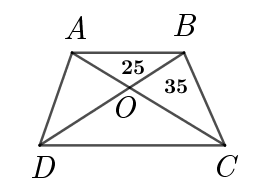

解题过程：

[例题2-3解析](ggb/例题2-3.ggb)

练习2-3. 如图，$S_2=2, S_3=4$，求梯形的面积。

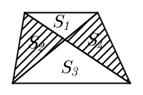

[练习2-3解析](practice/练习2-3.ggb)

<!-- 2-4 -->
**例2-4.** 如图，梯形ABCD的AB//CD,对角线AC和BD相交于点O，已知AB=5，CD=3，且梯形的面积是4，求三角形OAB的面积。

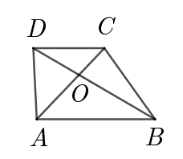

解题过程：

[例题2-4解析](ggb/例题2-4.ggb)

练习2-4. 如图，梯形的下底是上底的1.5倍，三角形OBC的面积是9，求三角形AOD的面积。

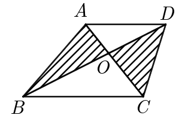

[练习2-4解析](practice/练习2-4.ggb)

<!-- 2-5 -->
**例2-5.** 如图，正方形ABCD的面积为3平方厘米, M是AD边上的中点。求图中阴影部分的面积。

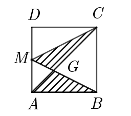

解题过程：

[例题2-5解析](ggb/例题2-5.ggb)

练习2-5. 如图，正方形ABCD中，E是BC边的中点，AE与BD相交于F点，三角形BEF的面积为1平方厘米，那么正方形ABCD面积是多少平方厘米？

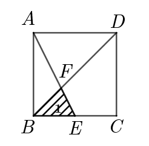

[练习2-5解析](practice/练习2-5.ggb)

## 8. 构造模型求面积

<!-- 2-6 -->
**例2-6.** 如图，E是平行四边形ABCD的CD边上一点，BD、AE相交于点F，已知三角形AFD的面积为6, 三角形DEF的面积是4。求四边形BCEF的面积。

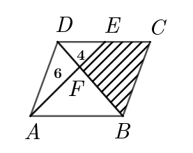

解题过程：

[例题2-6解析](ggb/例题2-6.ggb)

练习2-6. 如图，BD、CF将长方形ABCD分成4块，三角形DEF的面积为5平方厘米，三角形CED的面积是10平方厘米，那么四边形ABEF的面积是多少平方厘米？

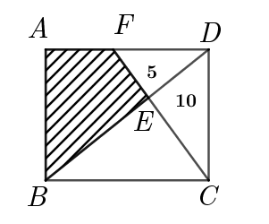

[练习2-6解析](practice/练习2-6.ggb)

## 总结

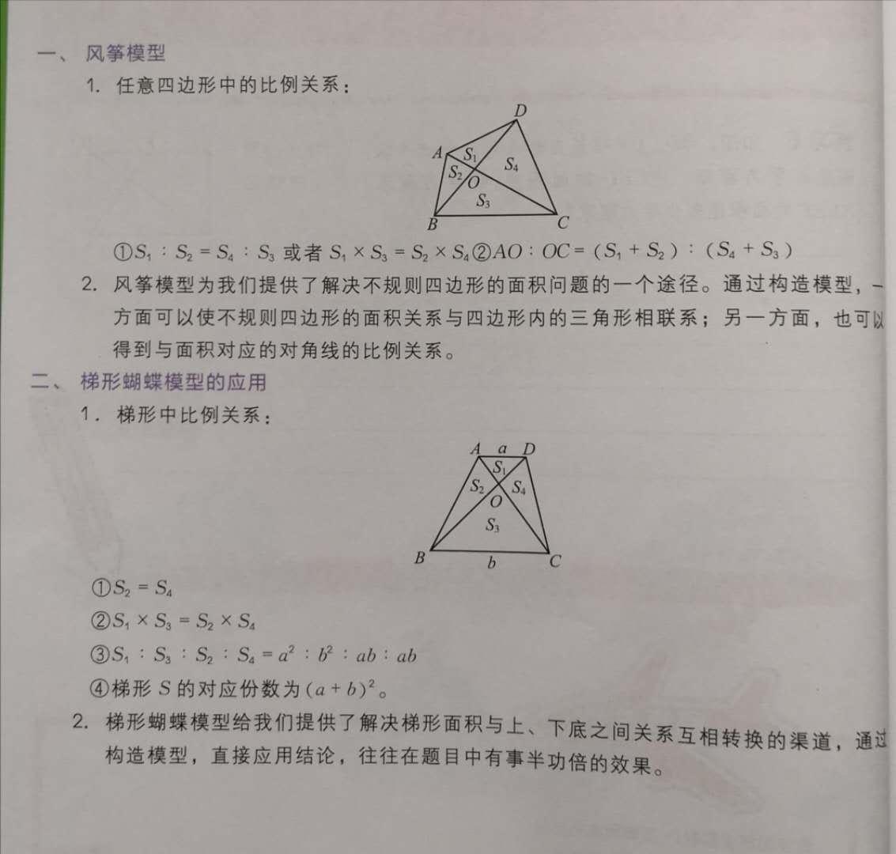
